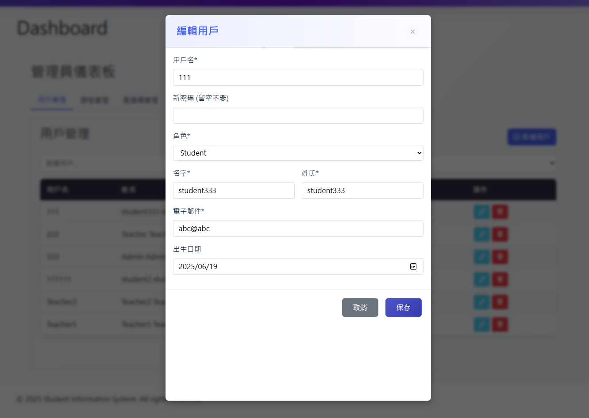
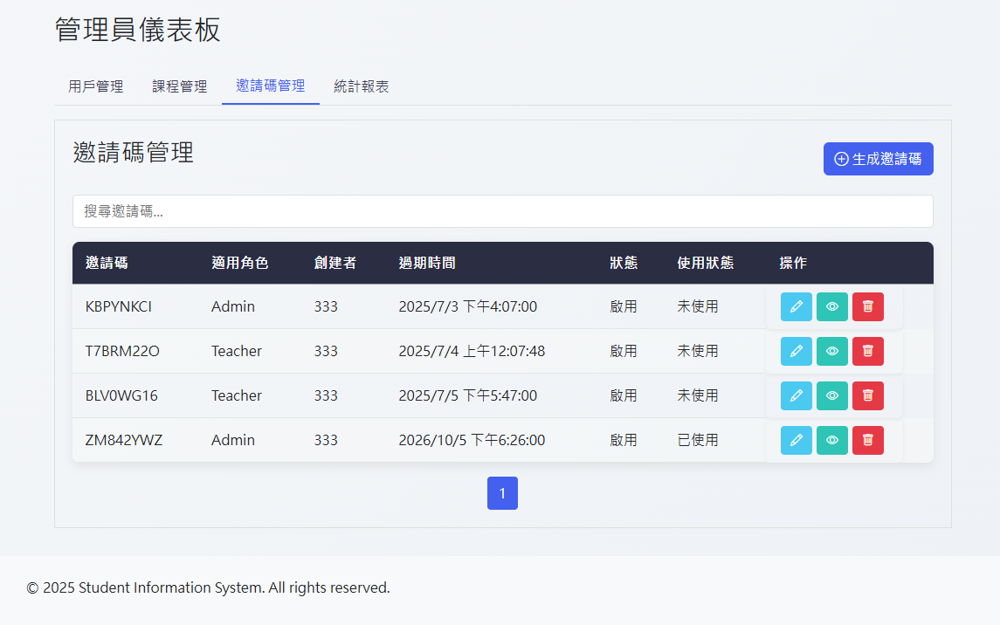

# 🎓 Fullstack Student Information System

This is a full-stack Student Information System (SIS) built with a React VITE frontend, ASP.NET Core Web API backend, and MS SQL database. The system provides student management, course management, and registration functions with role-based interfaces for students, teachers and administrators.

---

## 🚀 Features Overview

### 👤 User Management
- Supports registration and login for three roles: students, teachers, and administrators
- Invitation code system for registration control
- User permission management

### 📚 Course Management
- Course listing, search, and pagination
- Detailed course information view
- Teacher course assignment
- Course capacity management

### 📝 Registration Management
- Course registration for students
- Course withdrawal functionality
- Re-registration for withdrawn courses
- Course status tracking (registered, withdrawn, completed)

### 📊 Dashboard Functions
- **Student Dashboard**: Displays registered courses and credit statistics
- **Teacher Dashboard**: Manage taught courses and students
- **Admin Dashboard**: System statistics and user management, course management, invitation code management

---

## 🖼️ Preview


<details>
<summary>🏠 Homepage and Authentication (click to expand)</summary>


</details>

<details>
<summary>🛠️ Admin Interface (click to expand)</summary>







</details>

<details>
<summary>🎓 Student Interface (click to expand)</summary>


</details>

<details>
<summary>👨‍🏫 Teacher Interface (click to expand)</summary>


</details>

---

## 🏗️ Technical Architecture

### 💻 Frontend
- **Framework**: React + VITE
- **Styling**: Bootstrap 5, Bootstrap Icons, SCSS
- **State Management**: React Context API
- **Routing**: React Router dom
- **HTTP Requests**: Axios

### 🔗 Backend
- **Framework**: ASP.NET Core Web API (.NET8.0)
- **Data Access**: Entity Framework Core for database operations (CRUD)
- **Authentication**:MS JwtBearer, JWT Token for secure user authentication
- **Hash password**:BCrypt.Net-NEXT hash password.

### 🗄️ Database
- **MS SQL Server**: Relational database with 7 tables (Roles, Users, Courses, etc.), using primary and foreign keys for data integrity

---

## 📂 Project Structure
```text
fullstack-student-information-system/
│
├── frontend/              # React VITE frontend project
│   ├── src/               # Source code directory
│   │   ├── components/    # React components
│   │   ├── contexts/      # Context API
│   │   ├── pages/         # Page components
│   │   ├── services/      # API services
│   │   └── ...
│   └── ...
│
├── backend/               # ASP.NET Core Web API backend project
│   ├── Controllers/       # API controllers
│   ├── Models/            # Data models
│   ├── Services/          # Business logic services
│   ├── Dtos/              # Data Transfer Objects
│   └── ...
│
└── database/              # Database related files
    └── Std_info_sys.bak  # Sample data
```

---

## ⚙️ Installation and Setup

### Prerequisites

### Frontend Setup

### Backend Setup

### Database Setup
---

## 🖥️ System Demonstration

### 👨‍🎓 Student
- Browse course listings
- Register/withdraw from courses
- View personal credit statistics
- Check registered courses

### 👨‍🏫 Teacher
- Manage taught courses (course CRUD actions)
- View student registration status
- Update course information

### 🛡️ Administrator
- Manage all users (user CRUD actions)
- Manage all courses (course CRUD actions)
- Manage invitation codes (invitation code CRUD actions)
- View system statistics

---

## 🔐 Authentication and Authorization
The system uses JWT Tokens for authentication and implements role-based access control to ensure secure access to features based on user roles.

---

## 📱 Responsive Design
Implements responsive design using Bootstrap 5, ensuring a seamless user experience across devices (desktop, tablet, mobile).

---

## 👨‍💻 Author
本專案作為求職作品集，展示全端開發能力，包括前端與後端整合、資料庫設計和互動式使用者介面開發。  
This project serves as a job application portfolio, demonstrating full-stack development capabilities, including frontend-backend integration, database design, and interactive user interface development.